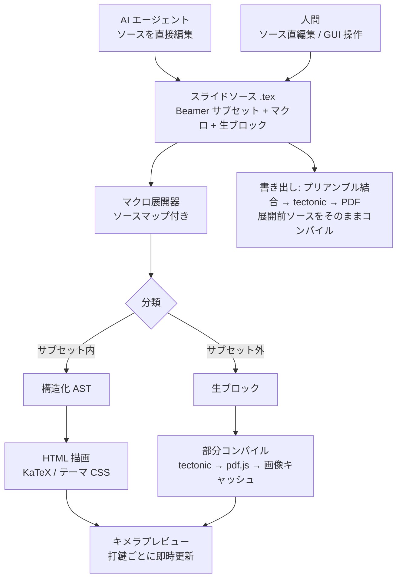

# 設計書

ステータス: draft / 最終更新: 2026-07-10

## 1. 目的と背景

AI にスライドの叩き台を出させ、人間が微調整して完成させる、という分業を成立させたい。既存形式には次の問題がある。

- PowerPoint: AI への指示出し・差分レビューが難しい(バイナリ、構造が不透明)。
- PDF などの完成形式: 人間が編集できない。
- 生の LaTeX(Beamer): 人間も AI も書けるが、GUI エディタとライブプレビューの実現が困難。

そこで、人間と AI が同じテキストを読み書きできる「共通言語」を軸に据える。チームは LaTeX を書き慣れているため、共通言語は Beamer のサブセットとする(Markdown 系 DSL は採らない)。

### 要件

1. プレビューは常時確認できること。LaTeX コンパイルの待ち時間(1 秒前後が下限)は許容しない。
2. 人間の GUI 操作は限定的でよい。GUI 操作が「よしなに」ソースへ変換されれば十分で、原文の厳密保存は要求しない。
3. AI への指示出し・生成・差分レビューが安定すること。
4. 最終出力(PDF)では LaTeX の表現力を制限しないこと。

## 2. 設計原則

1. **ソースが唯一の真実(single source of truth)。** `.tex` ソースファイルがすべて。AI のテキスト編集、人間のソース直編集、GUI 操作は、いずれも同じソースへの書き込みに還元される。エディタ内部状態・GUI・プレビューはすべてソースからの派生物。
2. **Beamer は出力フォーマット、編集レイヤーはサブセット。** ソースはそのまま正しい Beamer としてコンパイル可能。ただしツールが構文として理解するのはサブセットの範囲のみ。
3. **二層モデルと段階的劣化。** ソースは「構造化サブセット」と「生 LaTeX ブロック」の二層に分類される。サブセット内は完全理解(HTML 描画・GUI 編集可)、サブセット外は不透明な塊(部分コンパイル画像・移動のみ)。サブセット外を書いてもエラーにはならず、編集体験が劣化するだけ。
4. **正規形(canonical form)。** gofmt と同様に、整形規則をツールが一意に定める。保存時・AI 出力の取り込み時にフォーマッタを通し、GUI 操作は「AST 変換 + 触れたフレームの正規形再出力」で実装する。これにより人間・AI・GUI の三者が触っても diff が意味のある差分だけになる。人間の `%` コメントは直近の AST ノードに付随して保持し、消さない。
5. **TeX が意味論の最終権威。** HTML プレビューは近似であり、ズレたら PDF が正。プレビューは「意味と構造の確認」、書き出し PDF は「体裁の確認」と役割を分ける。
6. **AI はファイル経由で接続する。** v1 では AI 機能を内蔵しない。ソースファイルと CLI がインターフェースであり、任意のエージェント(Claude Code / Codex 等)がファイルを直接編集し、エディタはファイル監視で即時反映する。エージェントの作業手順・アドレッシング・SKILL.md による配布は [ai-protocol.md](ai-protocol.md) に定める。エージェントの検証手段は HTML プレビューではなく常に TeX(`deck check` / `deck snapshot`)であり、プレビューが検出できない溢れ・組版エラーをエージェントが先回りして潰す。後続フェーズの内蔵依頼(provider-neutral な AgentAdapter)でも、AI の編集は一時スナップショット経由の patch として同じソースへの書き込みに還元される(同 §7)。

## 3. 全体アーキテクチャ



要点:

- プレビュー経路はコンパイルを一切待たない。構造化部分は AST → HTML で毎打鍵描画し、生ブロックはキャッシュ済み画像を貼る(未キャッシュ時はプレースホルダ表示 → 完了後に差し替え)。
- 書き出しは**展開前のソース**を本物の TeX でコンパイルする。自前のマクロ展開器はプレビュー専用の近似であり、最終出力の正しさに関与しない。

## 4. パイプラインの構成要素

### 4.1 パーサ(core)

- 手書きの再帰下降パーサ。LaTeX 全体はパース不能だが、その必要はなく、ホワイトリスト文法で読める部分だけ読む。
- 未知の構文に遭遇したときのフォールバックは粒度の順に:
  1. 未知コマンド → コマンドと引数グループまでを生ブロック(インライン)に。
  2. 未知環境 → 対応する `\end{...}` まで(ネスト・verbatim 系を考慮)を生ブロックに。
  3. フレーム自体が解釈不能 → フレーム全体を「生フレーム」に(一覧・並べ替えは可能、内容は画像表示)。
- フレーム単位のインクリメンタル再パース。変更のあったフレームのみ再処理し、1000 行規模のデッキでも打鍵ごと数 ms を目標とする。
- コメント(`%`)と位置情報(source span)を AST ノードに保持する。

### 4.2 マクロ展開器(core)

- 公認の置き場(ソース冒頭の指定セクション。将来 `macros.tex` 分離も可)に定義された `\newcommand` / `\renewcommand` / `\newenvironment` のうち、**単純な引数置換**(省略可能引数のデフォルト値まで)だけを自前展開する。
- `\def` の区切り付き引数、`\expandafter`、条件分岐などの展開時制御は対象外とし、その**呼び出し箇所ごと**生ブロックに落とす(定義自体はエラーにしない)。
- 展開の各段階でソースマップ(展開後の範囲 → 元ソースの範囲)を保持する。プレビュー要素のクリック → ソース位置ジャンプ、およびリンター指摘の位置表示に用いる。
- プレビュー内インライン編集をマクロ引数へ書き戻す機能はソースマップの応用だが、v1 では必須としない(その箇所はソース直編集で代替できる)。

### 4.3 フォーマッタ・リンター(core)

- フォーマッタ: 正規形を定義し、冪等(`format(format(x)) == format(x)`)であること。コメントを保持すること。
- リンター: サブセット外構文の使用箇所(= 生ブロック化された箇所)の通知、展開不能マクロ、画像ファイル不存在、オーバーレイ番号の不整合、プリアンブル逸脱などを、ソース位置付きで報告する。
- どちらも CLI から実行可能にする。**リンターは AI の自己修正ループ(生成 → lint → 修正)の装置**でもある。

### 4.4 プレビュー(renderer)

- AST → HTML/CSS。スライドは論理サイズ固定(Beamer の用紙サイズ相当)の要素を CSS transform でスケールして表示する。
- 数式は KaTeX(同期・ミリ秒描画)。
- Beamer テーマの CSS 再現は v1 では `default` の 1 種類(2 テーマ目は HTML/PDF の座標差を fixture で評価してから追加)。
- キャンバスフレーム([subset-spec.md](subset-spec.md) §2.8)は本文領域を固定矩形として描画し、`x` / `y` / `w` を CSS の絶対配置へ、文字サイズ enum をテーマ CSS へ変換する。PDF 画像は pdf.js で表示する。
- オーバーレイ(`\pause`、`<n->`)はステップスライダーで段階表示できる。
- 行折返し位置や溢れの再現は原理的に不可能なため追求しない(原則 5)。

### 4.5 部分コンパイル(compiler)

- 生ブロックを standalone 文書として tectonic でコンパイルし、pdf.js で 2〜3 倍解像度にラスタライズして画像化。
- キャッシュキー: **展開後のブロック内容 + プリアンブルとマクロ定義のハッシュ**。定義変更時に古い画像が残ることを防ぐ。
- コンパイルはキュー処理でバックグラウンド実行し、UI を塞がない。

### 4.6 GUI 操作(ui / apps)

最小セットはキャンバスフレーム([subset-spec.md](subset-spec.md) §2.8)のレイアウト操作に集中する。一般テキストの入力・校正はソース直編集または AI に任せる。すべて「AST 変換 → 触れたフレームを正規形で再出力」で実装し、undo/redo はソースの編集履歴一本に統合する。優先順位([beamer-editor-additional-requirements.md](beamer-editor-additional-requirements.md) §3.6):

1. キャンバスオブジェクトの選択(単一選択のみ)
2. 移動(`x` / `y`)
3. 画像の拡大縮小(縦横比保持、`w` のみ変更)
4. テキスト幅変更(内容をリフロー)
5. 文字サイズ変更(離散値)
6. undo / redo
7. スライド一覧(サムネイル): 並べ替え・複製・削除・挿入
8. 必要性が確認できてから: オブジェクト追加・インライン本文編集

ドラッグ中は UI の一時状態だけを更新する。これは「ソースが唯一の真実」原則の明示的な例外であり、renderer / ui の契約として一時オーバーレイを定義する。ポインタを離した時点で AST 変換 + フォーマッタを 1 回実行してソースへ反映する(1 操作 = 1 差分 = 1 undo ステップ)。

GUI 操作の結果は常にソースペインに即座に反映され、「GUI は共通言語の代筆をしているだけ」であることが見えるようにする。

微調整もまた AI に依頼できる。GUI 操作と AI 編集はどちらも「ソースへの書き込み」に還元されるため両者は交換可能で、人間は場面ごとに GUI・ソース直編集・AI 依頼のうち楽な手段を選べばよい。エディタは選択中の要素を対象とした AI への依頼ディスパッチ(選択 →「AI に依頼」→ デッキごとの永続エージェントセッション)を段階的に備える([ai-protocol.md](ai-protocol.md) §7)。ファイル監視で届いた外部(AI)編集は undo 履歴の 1 ステップとして取り込み、気に入らない変更を Cmd+Z で戻せるようにする。

これらの UI(プレビュー・スライド一覧・GUI 操作・依頼ボックス)は共有パッケージ `ui` に一度だけ実装し、まず VS Code 拡張シェルがホストする。第 2 シェル(Electron、M4 後)も同じ ShellHost 契約(§7)でホストする。

## 5. 主要な設計決定と理由

| 決定 | 却下した代替案 | 理由 |
|---|---|---|
| ソースは Beamer サブセット | Markdown 系 DSL(Pandoc/Marp/Quarto)、Typst | チームが LaTeX を書き慣れており可読性の前提が成立。ソース = 出力言語なので変換忠実性の問題が消える。AI も Beamer をゼロショットで書ける |
| プレビューは HTML 近似 + 部分コンパイルのキメラ | 毎回 LaTeX コンパイル | コンパイルは高速化しても 1 秒前後が下限で打鍵ごとに不可。近似で意味を即時確認し、体裁は PDF で確認する役割分担 |
| 正規形フォーマッタ + AST 再出力 | CST による原文厳密保存 | GUI 操作の厳密な原文保存は要求しないと合意済み。実装が大幅に軽くなり、diff の安定という便益は正規形で十分得られる |
| マクロは事前展開(プレビュー用の近似) | マクロ禁止 | 禁止ではなく透過に。展開可能なものは構造描画に残り、不能なものは生ブロックに劣化するだけ。書き出しは展開前ソースを TeX に渡すので最終結果は常に正しい |
| 自由配置を v1 に前倒しし、`deckcanvas` / `decktext` / `deckimage` ラッパーで導入 | textpos 等の直接露出、自由配置の v2 送り、PowerPoint 型の汎用描画 | 「移動・拡縮がソースへ反映される」が GUI の中核要件のため後回しにできない(後回しにするとパーサ・AST・フォーマッタ・renderer を後から変更することになる)。ラッパーなら実装パッケージを将来交換でき、フォーマッタが座標を正規化して diff ノイズを抑えられる。位置指定テキストと画像に限定し、汎用描画機能にはしない |
| プリアンブルはツール管理(ユーザー自由領域はマクロセクションと生の追加領域のみ) | プリアンブル自由編集 | 語彙が閉じていることが共通言語の価値の源泉。パーサと AI の双方が本文を理解できる状態を守る |
| AI は v1 非内蔵、ファイル + CLI がインターフェース(内蔵依頼は後続で provider-neutral な AgentAdapter) | チャット UI 内蔵先行、特定 provider への依存 | ファイル監視で任意のエージェントと接続でき、実装が薄い。MVP は Claude Code / Codex の公式 VS Code 拡張との同居で成立する。内蔵依頼は認証・権限・競合・undo を含むため、GUI と CLI の安定後に追加する |
| シェルは VS Code 拡張 1 本で開始(Electron は M4 後の第 2 シェル) | 両立て同時並行、Electron 単独、Tauri | 拡張はエディタ・undo・競合処理・診断・SecretStorage を標準機能で得られ、Claude Code / Codex の公式拡張と同一ウィンドウに同居できるためドッグフーディング到達が最短。両立て並行は注意の分散が大きく撤回した。UI は共有パッケージ + ShellHost 契約で書き、Electron 追加時の手戻りを抑える。Tauri は JS 可読性の点で不採用 |

## 6. 技術スタック

| 領域 | 採用 | 選定理由 |
|---|---|---|
| シェル (1) | VS Code 拡張 | エディタ・undo・競合処理・git diff・診断表示(Diagnostics)・SecretStorage を標準機能で獲得。Claude Code / Codex と同一ウィンドウに同居し、ドッグフーディング到達が最短 |
| シェル (2)(M4 後) | Electron + electron-vite | 独立アプリとしての体験。VS Code 版で正規形・GUI セマンティクス・AI patch 適用・tectonic 配布が安定してから着手。チームの JS 可読性。ネイティブ依存は tectonic のみ |
| UI | React(共有パッケージ `ui`) | プレビュー・スライド一覧・GUI 操作・依頼ボックスを 1 回だけ実装し、VS Code の Webview でホストする。第 2 シェル(Electron)追加時は同じものを BrowserWindow で共用する |
| ソースエディタ | VS Code 標準(拡張)/ CodeMirror 6(Electron) | CodeMirror は Monaco より軽量で、lint 装飾・インライン UI が作りやすい |
| 数式描画 | KaTeX | 同期・ミリ秒描画。打鍵ごと更新に耐える |
| パーサ | 自作再帰下降(TypeScript) | 「未知 → 生ブロック」というエラー回復が文法の中心にあり、手書きが最も制御しやすい。全体 1〜2 千行の見通し |
| LaTeX エンジン | tectonic | 単一バイナリ・パッケージ自動取得。メンバーに TeXLive を要求しない |
| PDF 画像化 | pdf.js | 純 JS でネイティブ依存を増やさない。鮮明さが必要になったら dvisvgm 等の SVG 化を検討 |
| ファイル監視 | chokidar | 外部エージェントの編集を即時反映 |
| リポジトリ | pnpm workspace モノレポ | コアの環境非依存分離を構造で強制する |

## 7. リポジトリ構成(予定)

```
beamer-editor/
├── docs/                  # 本設計書ほか
├── fixtures/              # ゴールデンサンプルデッキ(テスト・受け入れ基準)
├── packages/
│   ├── core/              # パーサ / AST / マクロ展開 / フォーマッタ / リンター(依存ゼロの純 TS)
│   ├── renderer/          # AST → プレビュー HTML(KaTeX、テーマ CSS)
│   ├── ui/                # 共有 React UI(プレビュー・スライド一覧・GUI 操作・依頼ボックス)
│   ├── compiler/          # tectonic 呼び出し / 部分コンパイル / キャッシュ(Node)
│   └── cli/               # lint / format / export ほかの CLI(core + compiler の薄い束ね)
└── apps/
    ├── vscode/            # VS Code 拡張シェル(TextDocument/WorkspaceEdit、Diagnostics、Webview ホスト)
    ├── desktop/           # Electron シェル(第 2 シェル、M4 後に着手。CodeMirror、fs、IPC)
    └── web/               # renderer 開発用ビューア(正式製品化は需要が出るまで保留)
```

制約:

- `core` と `renderer` は Node 固有 API・Electron API・VS Code API に依存しない(web でそのまま動く)。`compiler` のみ Node 依存。
- `ui` はシェルの機能(編集の適用、変更の購読、ファイルダイアログ、コンパイル呼び出し、AI 依頼の送信)を **ShellHost インターフェース**越しにのみ使う。シェル差はこの契約の実装(アダプタ)に閉じ込め、`ui` 本体には一切持ち込まない。将来の Electron(第 2 シェル)追加コストを抑える要がこの境界。

## 8. Web 版の扱い

コアとプレビューはブラウザでそのまま動く。Web 版で欠けるのは部分コンパイルと PDF 書き出しのみ。ただし、ローカルファイル監視・tectonic・AI エージェント・秘密情報管理・undo まで含めるとバックエンドまたはローカルヘルパーが必要になり、全体としては最も複雑になる([beamer-editor-additional-requirements.md](beamer-editor-additional-requirements.md) §5)。正式製品化は「ブラウザだけで使いたい」という明確な需要が出るまで判断を保留する。

- 当面: `apps/web` は renderer の開発用ビューア(ファイルドロップ → 表示)として維持する。
- 正式化する場合の第一段階: 生ブロックはプレースホルダ表示に劣化、書き出し不可、として提供する。
- 第二段階(必要になったら): tectonic を入れた小さなコンパイル API サーバーを立て、両機能をそこへ投げる。
- ブラウザ内 WASM TeX(SwiftLaTeX 系)は初回速度と保守性の問題から採用しない。

## 9. リスクと未決事項

| 項目 | 内容 | 方針 |
|---|---|---|
| テーマ再現度 | HTML プレビューと PDF の見た目のズレ(特に行折返し・溢れ) | 原理的に消えないと割り切る。将来、プレビュー側での溢れヒューリスティック警告を検討 |
| tabular の対応範囲 | 表の構文は奥が深い | v1 は booktabs + 基本列指定のみ(仕様参照)。逸脱は生ブロックへ |
| tectonic の配布 | バイナリ同梱か初回ダウンロードか | Phase 6 で決定。まず開発機ではパス指定で動かす |
| キャンバスの縦溢れ・重なり | textpos 系の絶対配置は縦にはみ出しても Overfull 警告が出ず、`deck check` の安全網が素通しになる | `zref-savepos` で各オブジェクトの実測位置を aux に出力させ、check がはみ出し(warning)・重なり(info)を機械検出する([subset-spec.md](subset-spec.md) §2.8) |
| 同時編集の競合 | エディタ内未保存変更中に外部(AI)がファイルを書き換えた場合 | 外部 CLI(M2): 依頼前に保存し、dirty buffer は警告、外部変更は undo 1 ステップで取り込み、競合時は黙って上書きせず diff 表示。内蔵 AI(Phase 9): 一時 worktree で編集 → frame ハッシュ検査 → ShellHost 経由 patch 適用([ai-protocol.md](ai-protocol.md) §7) |
| プレビュー内インライン編集とマクロ | 展開後表示への編集をマクロ引数へ書き戻すにはソースマップ逆引きが必要 | ソースマップは最初から実装するが、書き戻し UI は v1 必須にしない |
| 発表者ノート・配布資料 | `\note{}`、handout モード | v1 スコープ外。仕様の将来拡張候補に記載 |
| ShellHost 契約の VS Code 偏り | 当面シェルが VS Code 拡張 1 本のため、契約が VS Code 固有機能(WorkspaceEdit 等)に寄ると Electron 追加時に手戻りになる | UI はシェル機能を ShellHost 越しにのみ使い、シェル固有 API を `ui` へ持ち込まない。Electron 着手時に fixture デッキの共通チェックリストでパリティを確認する |
